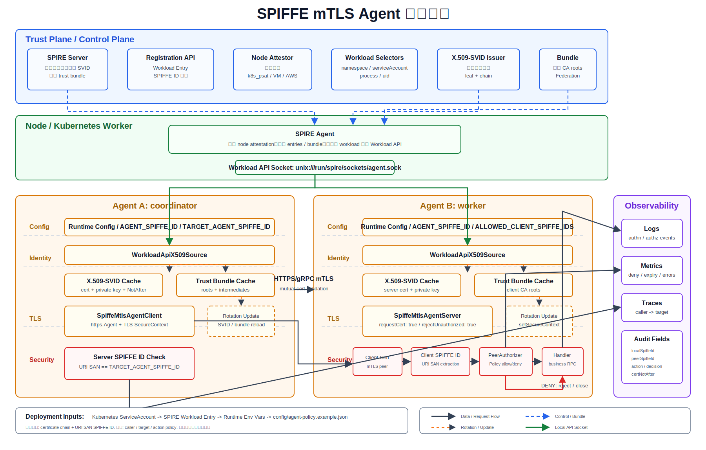
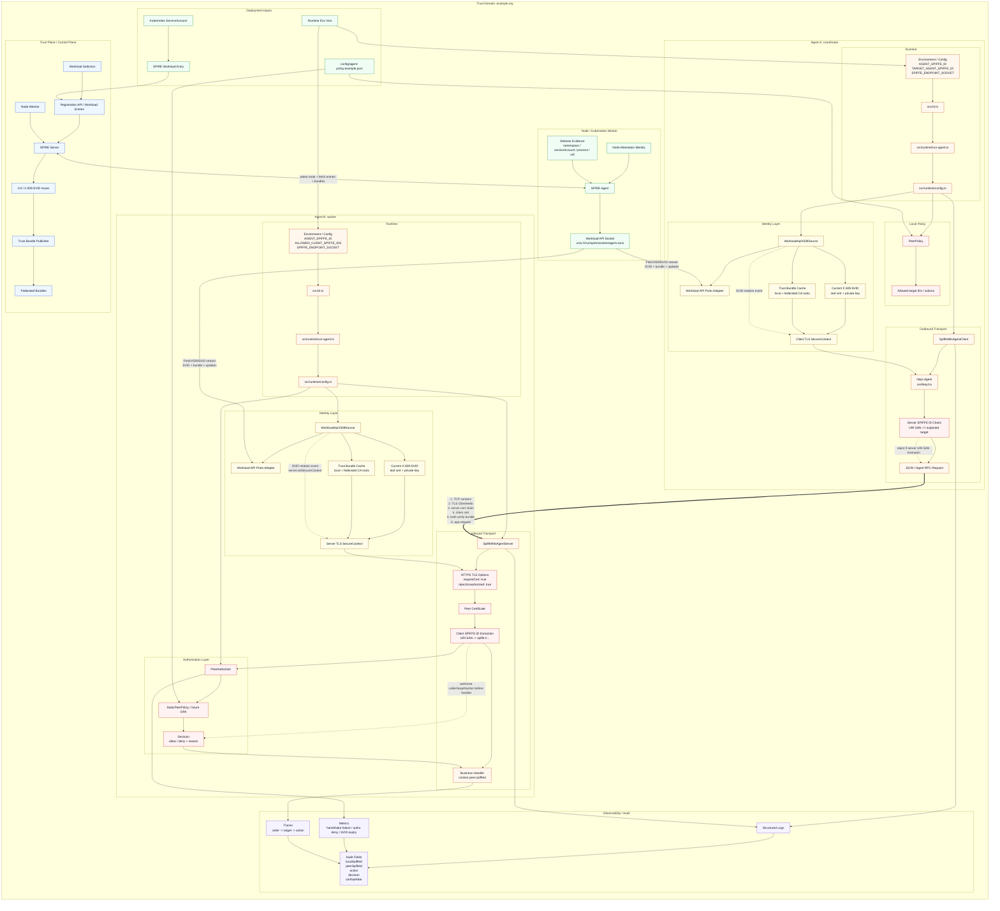

# SPIFFE mTLS Agent 完整架构图

这张图覆盖项目级完整边界：信任平面、节点平面、Agent 运行时、mTLS 握手、授权策略、证书轮换、观测审计、部署入口。

## 读图顺序

1. `SPIRE Server` 按 `Workload Entry + selectors` 决定哪个 workload 可拿哪个 SPIFFE ID。
2. 每个节点的 `SPIRE Agent` 完成 node attestation 后，向本机 workload 暴露 `Workload API Socket`。
3. Agent 进程只连本机 socket，拿短期 `X.509-SVID + trust bundle`，不保存长期证书或共享 token。
4. Agent A 出站时使用自己的 SVID 建 TLS，并显式要求目标 ID 等于 `TARGET_AGENT_SPIFFE_ID`。
5. Agent B 入站时要求 client cert，从 URI SAN 提取 client SPIFFE ID，在 handler 前做 policy 授权。
6. Workload API stream 推送轮换事件，IdentitySource 更新 client agent / server secure context。
7. 日志和指标围绕 `localSpiffeId / peerSpiffeId / action / decision / certNotAfter`，避免记录私钥和完整证书。

## 安全边界

- Trust domain：决定证书链可信范围。
- SPIFFE ID：决定 workload 身份，不等同于权限。
- Policy：决定 caller 能否访问 target/action。
- Workload API socket：决定本机进程能否取得 SVID，必须靠权限、selector、service account 收紧。
- Expected server ID check：防止同 trust domain 内其他 workload 冒充目标 Agent。