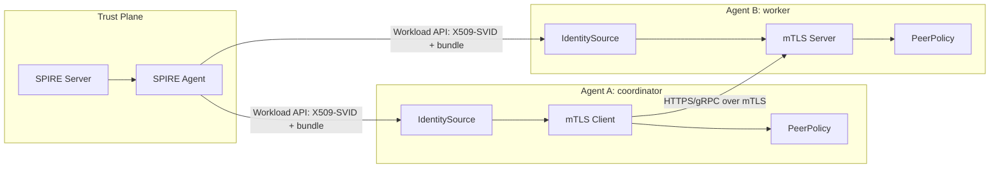

# SPIFFE mTLS Agent 通信架构

## 目标

用 SPIFFE/SPIRE 建立 Agent 间双向认证通信：

- 每个 Agent 运行时从本机 SPIRE Agent 获取短期 X.509-SVID。
- Client 校验 Server 证书链后，再校验 URI SAN 中的 SPIFFE ID 是否等于目标 Agent ID。
- Server 要求 Client 证书，并在业务 handler 前按 Client SPIFFE ID 执行授权。
- 证书轮换由 Workload API stream 驱动，不落静态私钥到项目配置。

## 设计选择

TypeScript 项目保留 Workload API adapter，不把 gRPC/proto 细节散落到业务层。若后续 Agent 核心改成 Go，Identity 层可替换为官方 `go-spiffe` SDK；Policy、Transport、Runtime 的项目边界保持不变。

完整全景图：`docs/architecture/spiffe-agent-mtls-complete-architecture.md`


## 图文入口

| 图片 | 说明 |
| --- | --- |
| [完整架构图](spiffe-agent-mtls-complete-architecture.svg) | 信任平面、节点平面、Agent 运行时、策略、观测全边界 |
| [握手时序图](spiffe-mtls-handshake-sequence.svg) | 一次 Agent 调用的 mTLS + authorization 流程 |
| [SVID 轮换图](spiffe-svid-rotation-lifecycle.svg) | Workload API stream 如何驱动证书热更新 |
| [代码地图](spiffe-agent-code-map.svg) | 源码目录如何对应架构层 |



## 模块边界

| 模块 | 文件 | 责任 |
| --- | --- | --- |
| SPIFFE ID | `src/spiffe/spiffe-id.ts` | ID 校验、trust domain/path 解析 |
| X.509 material | `src/spiffe/workload-x509-source.ts` | 连接 Workload API、选择 SVID、转换 DER/PEM、监听轮换 |
| Peer certificate | `src/spiffe/peer-certificate.ts` | 从 URI SAN 提取唯一 SPIFFE ID |
| Policy | `src/policy/peer-policy.ts` | caller/target/action 授权，不耦合 TLS |
| Server transport | `src/transport/spiffe-http-server.ts` | `requestCert`、client ID 校验、secure context 热更新 |
| Client transport | `src/transport/spiffe-http-client.ts` | expected server SPIFFE ID 校验、JSON request |
| Runtime | `src/runtime/` | 环境变量到运行时配置 |

## 调用链路

1. `runServerFromEnv` 读取 `AGENT_SPIFFE_ID`，启动 `WorkloadApiX509Source`。
2. `WorkloadApiX509Source` 调用 Workload API `FetchX509SVID`，拿到 leaf cert、private key、bundle、federated bundles。
3. `SpiffeMtlsAgentServer` 用当前 material 创建 HTTPS server，开启 `requestCert: true`。
4. Client 同样加载自己的 SVID，通过 `SpiffeMtlsAgentClient` 发起 HTTPS 请求。
5. Client TLS 校验证书链后，`checkExpectedServerSpiffeId` 验证 server URI SAN。
6. Server TLS 校验 client 证书链后，`extractSpiffeIdFromPeerCertificate` 取 client ID。
7. `PeerAuthorizer.assertAuthorized` 校验 caller/target/action。
8. 业务 handler 接收 `context.peer.spiffeId`，后续审计日志只记录 SPIFFE ID，不记录证书内容或私钥。

## 项目级身份命名

推荐格式：

```text
spiffe://<trust-domain>/agent/<agent-name>
spiffe://<trust-domain>/agent/<agent-name>/task/<task-class>
spiffe://<trust-domain>/ns/<namespace>/sa/<service-account>
```

约束：

- `trust-domain` 是安全边界，不用环境名随意拼接。
- Agent 名是稳定职责，不用 Pod 名、IP、随机实例 ID。
- 动作权限属于 policy，不编码进 SPIFFE ID。

## 授权模型

TLS 层只做“对方是谁”。业务层做“对方能做什么”。

```json
{
  "sourceId": "spiffe://example.org/agent/coordinator",
  "targetIds": ["spiffe://example.org/agent/worker"],
  "actions": ["agent:http"]
}
```

后续扩展：

- 本地 JSON policy：适合 demo / 单服务。
- OPA / Cedar / Casbin：适合多 Agent、多动作、多租户。
- Control-plane 下发：适合动态拓扑，但必须签名并审计版本。

## 生产落地

1. 部署 SPIRE Server 和每节点 SPIRE Agent。
2. 为节点建立 node attestation；Kubernetes 推荐 `k8s_psat`。
3. 为每类 Agent 注册 workload entry；selectors 绑定 namespace/service account。
4. 应用只挂载 Workload API socket，不挂载长期证书。
5. Agent 启动时必须指定自己的 `AGENT_SPIFFE_ID`；如果 Workload API 返回多个 SVID，明确选择一个。
6. 每个出站调用必须配置 `TARGET_AGENT_SPIFFE_ID`，禁止只依赖 hostname。
7. 日志记录 `localSpiffeId`、`peerSpiffeId`、action、decision、cert expiry。

## 风险和守护

- Workload API socket 权限过宽：非目标进程可能拿到 SVID。用 Unix socket 权限、Kubernetes service account、workload selectors 收紧。
- 只校验证书链不校验 SPIFFE ID：会变成“同 trust domain 任意工作负载可冒充目标”。Client 必须执行 expected ID check。
- Policy 写在 handler 内部：容易漏。Server transport 必须在 handler 前统一授权。
- SVID 轮换未处理：长跑进程会在过期后失联。IdentitySource 必须订阅 stream 并更新 server secure context。
- 跨 trust domain federation：只在明确业务需要时开启；policy 需显式允许 foreign trust domain。

## 和官方 SDK 的关系

- Go 服务：优先用 `go-spiffe`，让 SDK 管 Workload API source、TLS config、authorizer。
- TypeScript 服务：当前项目把 Workload API 封装在 `WorkloadApiX509Source`。它是 SDK port，未来出现稳定 Node SDK 时只替换这一层。
- 不能直接接 Workload API 的进程：用 SPIFFE Helper 把 SVID/key/bundle 写到文件并通知进程 reload，但项目内新代码优先用 SDK/adapter 直连。