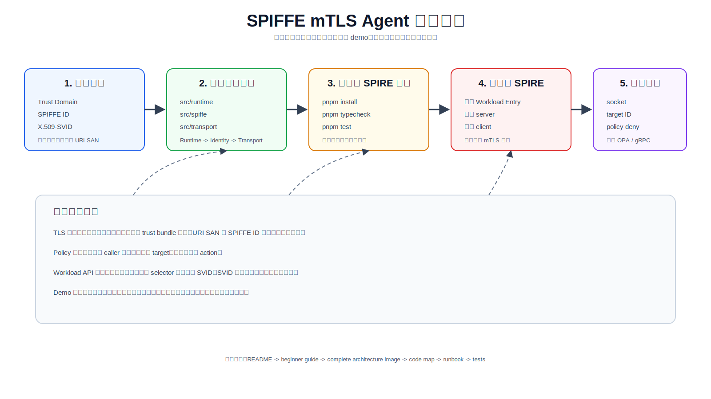
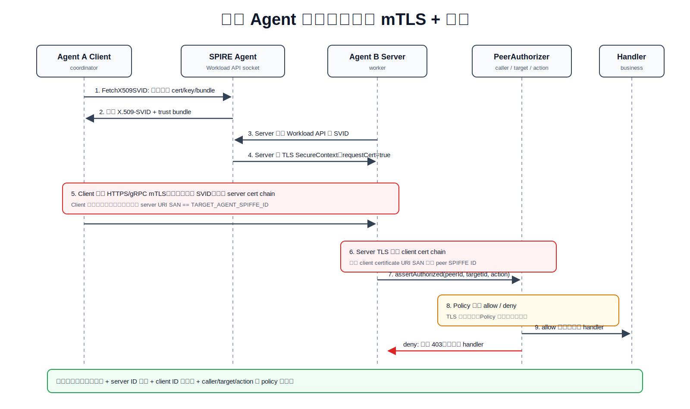
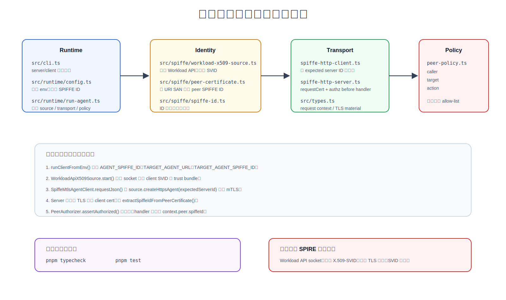
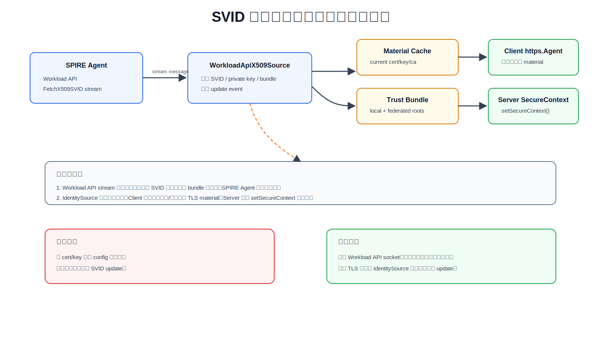

# SPIFFE mTLS Agent 新手图文教程

这份教程面向第一次接触 SPIFFE / SPIRE / mTLS Agent 通信的人。先建立心智模型，再对应到代码，最后接真实 SPIRE 环境跑通。



## 你要先记住的 6 个词

| 名词 | 一句话理解 | 在本 demo 中的位置 |
| --- | --- | --- |
| Trust Domain | 一组可信身份的命名边界，比如 `example.org` | `spiffe://example.org/...` |
| SPIFFE ID | workload 的稳定身份，不是 IP，不是 DNS | `spiffe://example.org/agent/worker` |
| X.509-SVID | 带 SPIFFE ID 的短期证书，URI SAN 内含身份 | `WorkloadApiX509Source` 缓存 |
| Trust Bundle | 用来验证对端 SVID 的 CA 根集合 | `SpiffeTlsMaterial.ca` |
| Workload API | workload 向本机 SPIRE Agent 取 SVID 的接口 | `SPIFFE_ENDPOINT_SOCKET` |
| Policy | 认证之后的授权规则：谁能调用谁、做什么 | `src/policy/peer-policy.ts` |

核心句：TLS 证明“对方是谁”，Policy 决定“对方能不能做这件事”。

## 先看全景，再看细节

| 图 | 用途 |
| --- | --- |
| [完整架构图](../architecture/spiffe-agent-mtls-complete-architecture.svg) | 看项目所有边界：SPIRE、Workload API、Agent、Policy、Observability |
| [握手时序图](../architecture/spiffe-mtls-handshake-sequence.svg) | 看一次 Agent A 调用 Agent B 时发生什么 |
| [SVID 轮换图](../architecture/spiffe-svid-rotation-lifecycle.svg) | 看为什么不能把证书写死到配置里 |
| [代码地图](../architecture/spiffe-agent-code-map.svg) | 看每个源码目录负责哪一层 |


## 第 -1 步：启动页面服务，先看全过程

```bash
pnpm demo:spiffe
```

打开 `http://127.0.0.1:5173`。

页面包含 4 个区：

| 区域 | 用途 |
| --- | --- |
| 最小运行模型 | 看 SPIRE Server、SPIRE Agent、Coordinator、Worker、Policy、Audit 的关系 |
| 一次 Agent 通信过程 | 播放成功路径，逐步看 mTLS + 授权 |
| 失败路径演示 | 一键看 target ID mismatch、policy deny、socket missing |
| 启动命令 | 复制页面服务命令和真实 SPIRE server/client 命令 |

这个页面是学习用可视化服务，不伪造真实 SPIRE。要验证真实 mTLS，需要继续执行下面“接真实 SPIRE”的 server/client 命令。
## 第 0 步：不接 SPIRE，先验证项目没坏

这一步不需要 SPIRE Server/Agent。它只验证 TypeScript、纯逻辑、policy 和 SPIFFE ID 解析。

```bash
pnpm install
pnpm typecheck
pnpm test
```

预期：`typecheck` 无错误，`test` 全通过。

这一步不能证明真实 mTLS 握手成功，因为真实握手需要 Workload API socket 和真实 X.509-SVID。

## 第 1 步：理解 demo 的两端

本 demo 用两个 Agent 建模：

| 角色 | SPIFFE ID | 作用 |
| --- | --- | --- |
| Coordinator | `spiffe://example.org/agent/coordinator` | Client，发起请求 |
| Worker | `spiffe://example.org/agent/worker` | Server，接收请求 |

授权规则在 [config/agent-policy.example.json](../../config/agent-policy.example.json)：Coordinator 可以调用 Worker 的 `agent:http` action。

```json
{
  "sourceId": "spiffe://example.org/agent/coordinator",
  "targetIds": ["spiffe://example.org/agent/worker"],
  "actions": ["agent:http"]
}
```

## 第 2 步：一次请求怎么过



流程：

1. Agent A 通过 Workload API 拿自己的 X.509-SVID 和 trust bundle。
2. Agent B 也通过 Workload API 拿自己的 X.509-SVID 和 trust bundle。
3. Agent A 发起 HTTPS/gRPC mTLS，请求里带自己的 client certificate。
4. Agent A 校验 Agent B 的证书链，并检查 server certificate 的 URI SAN 是否等于 `TARGET_AGENT_SPIFFE_ID`。
5. Agent B 校验 Agent A 的证书链，从 client certificate URI SAN 提取 caller SPIFFE ID。
6. Agent B 在 handler 前调用 `PeerAuthorizer.assertAuthorized()`。
7. 授权通过后，业务 handler 才能读取 `context.peer.spiffeId`。

失败时优先判断是哪一层失败：

| 现象 | 多半是哪层 | 看什么 |
| --- | --- | --- |
| 找不到 socket | Workload API | `SPIFFE_ENDPOINT_SOCKET`、SPIRE Agent 是否运行 |
| SVID 不是期望 ID | SPIRE registration | Workload Entry selectors、`AGENT_SPIFFE_ID` |
| client 拒绝 server | mTLS 身份校验 | `TARGET_AGENT_SPIFFE_ID` 是否等于 server URI SAN |
| server 返回 403 | Policy | `ALLOWED_CLIENT_SPIFFE_IDS` 或 policy 规则 |
| 运行一段时间后失败 | SVID 轮换 | Workload API stream、`setSecureContext()` 更新 |

## 第 3 步：代码怎么对应架构



推荐读代码顺序：

1. [src/runtime/config.ts](../../src/runtime/config.ts)：看环境变量如何变成运行时配置。
2. [src/runtime/run-agent.ts](../../src/runtime/run-agent.ts)：看 server/client 如何组装 Identity、Transport、Policy。
3. [src/spiffe/workload-x509-source.ts](../../src/spiffe/workload-x509-source.ts)：看 Workload API、SVID 缓存、bundle、轮换。
4. [src/transport/spiffe-http-client.ts](../../src/transport/spiffe-http-client.ts)：看 client 如何检查 expected server SPIFFE ID。
5. [src/transport/spiffe-http-server.ts](../../src/transport/spiffe-http-server.ts)：看 server 如何要求 client cert，并在 handler 前授权。
6. [src/policy/peer-policy.ts](../../src/policy/peer-policy.ts)：看 caller / target / action 授权模型。

## 第 4 步：接真实 SPIRE 跑通

前提：本机或 Kubernetes 节点已有 SPIRE Server 和 SPIRE Agent，并暴露 Workload API socket。

先按 [deploy/spire/registration-entries.md](../../deploy/spire/registration-entries.md) 注册两个 workload entry。

启动 Worker：

```bash
SPIFFE_ENDPOINT_SOCKET=unix:///run/spire/sockets/agent.sock \
AGENT_SPIFFE_ID=spiffe://example.org/agent/worker \
ALLOWED_CLIENT_SPIFFE_IDS=spiffe://example.org/agent/coordinator \
PORT=8443 \
pnpm --filter @agent-demo/spiffe-mtls-agent start:server
```

预期输出类似：

```json
{"ok":true,"mode":"server","spiffeId":"spiffe://example.org/agent/worker","port":8443,"expiresAt":"..."}
```

启动 Coordinator：

```bash
SPIFFE_ENDPOINT_SOCKET=unix:///run/spire/sockets/agent.sock \
AGENT_SPIFFE_ID=spiffe://example.org/agent/coordinator \
TARGET_AGENT_URL=https://worker.agents.svc:8443/ \
TARGET_AGENT_SPIFFE_ID=spiffe://example.org/agent/worker \
pnpm --filter @agent-demo/spiffe-mtls-agent start:client
```

预期响应类似：

```json
{
  "ok": true,
  "serverId": "spiffe://example.org/agent/worker",
  "clientId": "spiffe://example.org/agent/coordinator",
  "method": "GET",
  "url": "/"
}
```

## 第 5 步：理解证书轮换



不要把证书路径、私钥、CA bundle 写死到项目配置。这个 demo 的规则是：

- 启动时从 Workload API 拉取当前 SVID 和 trust bundle。
- 长跑进程持续监听 Workload API stream。
- 收到新 SVID 后，client 后续请求使用新 material。
- server 收到新 SVID 后调用 `server.setSecureContext()` 热更新。

## 修改 demo 时的安全检查清单

- Client 是否同时校验证书链和 `TARGET_AGENT_SPIFFE_ID`？
- Server 是否设置 `requestCert: true` 和 `rejectUnauthorized: true`？
- Server 是否在业务 handler 前提取 client SPIFFE ID 并授权？
- Policy 是否表达 caller / target / action，而不是把权限塞进 SPIFFE ID？
- 日志是否只记录 SPIFFE ID、action、decision、expiry，不记录 private key 或完整证书？
- 新增通信协议时，是否复用 IdentitySource 和 PeerAuthorizer，而不是重新绕过 TLS 层？

## 常见扩展方向

| 需求 | 推荐改法 |
| --- | --- |
| HTTP 改 gRPC | 保留 IdentitySource，替换 Transport 层 TLS config |
| 静态 allow-list 改复杂授权 | 把 `PeerPolicy` 实现替换为 OPA / Cedar / Casbin adapter |
| 多 trust domain | 显式配置 federated bundle，并在 policy 中允许 foreign trust domain |
| TypeScript 改 Go | 用 `go-spiffe` 替换 Identity 层，保留 Policy / Runtime 的边界设计 |
| 真实 e2e 测试 | 起 SPIRE Server/Agent test fixture，再跑 server/client smoke |